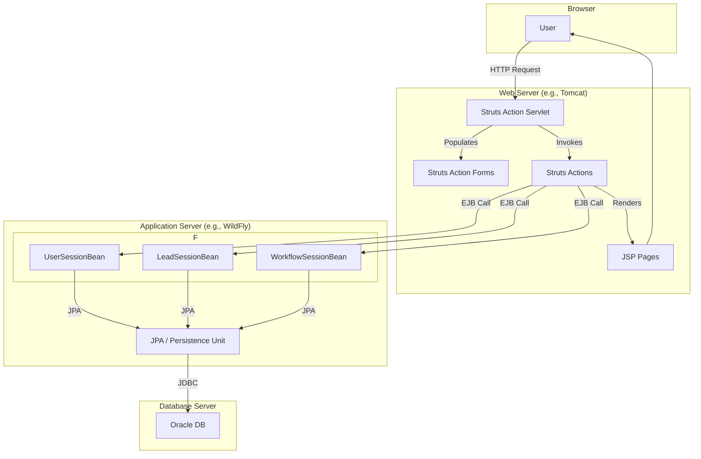

# System Design: Case Management Tool

## 1. Introduction

This document outlines the system design for the Case Management Tool for Mega Investment Group. The application is designed to manage the sales workflow, from lead generation to client conversion.

## 2. System Architecture

The application will be a J2EE application built using legacy technologies.

*   **Frontend**: JavaServer Pages (JSP) with the Apache Struts 1.x framework.
*   **Backend**: Enterprise JavaBeans (EJB 3.1) for business logic.
*   **Database**: Oracle Database.
*   **Build Tool**: Apache Maven.
*   **Application Server**: A J2EE 7 compatible application server (e.g., WildFly, GlassFish).

The application will be packaged as an Enterprise Application Archive (EAR), containing a Web Application Archive (WAR) for the frontend and an EJB JAR for the backend.

### 2.1. Component Level Architecture



## 3. Database Schema

The database will store information about users, leads, and related activities.

```sql
-- Users Table
CREATE TABLE APP_USERS (
    USER_ID NUMBER PRIMARY KEY,
    USERNAME VARCHAR2(50) NOT NULL UNIQUE,
    PASSWORD VARCHAR2(255) NOT NULL, -- Hashed password
    ROLE VARCHAR2(20) NOT NULL CHECK (ROLE IN ('SALES_PERSON', 'SALES_MANAGER'))
);

-- Leads Table
CREATE TABLE LEADS (
    LEAD_ID NUMBER PRIMARY KEY,
    LEAD_NAME VARCHAR2(100) NOT NULL,
    COMPANY VARCHAR2(100),
    EMAIL VARCHAR2(100),
    PHONE VARCHAR2(20),
    STATUS VARCHAR2(20) NOT NULL CHECK (STATUS IN ('NEW', 'ASSIGNED', 'IN_PROGRESS', 'PRE_CONVERSION', 'CONVERTED', 'REJECTED')),
    ASSIGNED_TO NUMBER,
    POTENTIAL_VALUE NUMBER(12, 2),
    LEAD_SOURCE VARCHAR2(50) CHECK (LEAD_SOURCE IN ('Partner Referral', 'Webinar', 'Website Signup', 'Cold Call')),
    LEAD_SCORE NUMBER,
    CREATED_DATE DATE DEFAULT SYSDATE,
    FOREIGN KEY (ASSIGNED_TO) REFERENCES APP_USERS(USER_ID)
);

-- Lead Comments/History Table
CREATE TABLE LEAD_HISTORY (
    HISTORY_ID NUMBER PRIMARY KEY,
    LEAD_ID NUMBER NOT NULL,
    USER_ID NUMBER NOT NULL,
    COMMENT_TEXT VARCHAR2(4000),
    ACTION VARCHAR2(100),
    TIMESTAMP DATE DEFAULT SYSDATE,
    FOREIGN KEY (LEAD_ID) REFERENCES LEADS(LEAD_ID),
    FOREIGN KEY (USER_ID) REFERENCES APP_USERS(USER_ID)
);

-- Sequences for Primary Keys
CREATE SEQUENCE APP_USERS_SEQ START WITH 1 INCREMENT BY 1;
CREATE SEQUENCE LEADS_SEQ START WITH 1 INCREMENT BY 1;
CREATE SEQUENCE LEAD_HISTORY_SEQ START WITH 1 INCREMENT BY 1;
```

## 4. Component Design

### 4.1. Frontend (WAR Module)

*   **JSPs**: For rendering views (login, registration, dashboard, lead details).
    *   `login.jsp`
    *   `register.jsp`
    *   `dashboard.jsp`
    *   `leadDetails.jsp`
    *   `error.jsp`
*   **Struts ActionForms**: To capture form data.
    *   `LoginForm.java`
    *   `RegistrationForm.java`
    *   `LeadForm.java`
*   **Struts Actions**: To handle user requests and interact with the backend.
    *   `LoginAction.java`
    *   `RegisterAction.java`
    *   `LogoutAction.java`
    *   `ViewDashboardAction.java`
    *   `DistributeLeadsAction.java` (Manager)
    *   `ViewLeadAction.java`
    *   `UpdateLeadAction.java`
    *   `ApproveLeadAction.java` (Manager)
*   **Configuration**:
    *   `web.xml`: Standard J2EE web application descriptor.
    *   `struts-config.xml`: Struts framework configuration for mappings, forwards, and plugins.

### 4.2. Backend (EJB Module)

*   **Entity Beans**: JPA entities mapping to the database tables.
    *   `User.java`
    *   `Lead.java`
    *   `LeadHistory.java`
*   **Session Beans (Stateless)**: To implement business logic.
    *   `UserSessionBean.java`: Handles user authentication and registration.
    *   `LeadSessionBean.java`: Manages lead creation, assignment, and updates.
    *   `LeadScoringSessionBean.java`: Calculates and assigns a score to new leads based on various criteria.
    *   `WorkflowSessionBean.java`: Handles the business process for lead approval and conversion.
*   **Configuration**:
    *   `persistence.xml`: JPA configuration for the persistence unit and data source.

## 5. Business Workflow

1.  **User Management**:
    *   Users can register as either a `SALES_PERSON` or `SALES_MANAGER`.
    *   Users can log in to the system.
    *   Passwords will be stored in a hashed format.

2.  **Lead Generation & Scoring**:
    *   A new lead is created in the system with a 'NEW' status.
    *   Upon creation, the system automatically calculates a `LEAD_SCORE` based on:
        *   **Potential Value**: Higher value means a higher score.
        *   **Lead Source**: Referrals get a higher score than cold calls.
        *   **Data Completeness**: Leads with both email and phone are scored higher.
    *   The dashboard for sales people will prioritize leads by sorting them based on this score.

3.  **Lead Distribution (Sales Manager)**:
    *   A Sales Manager can view all 'NEW' leads.
    *   The manager can trigger a "Distribute Leads" action.
    *   The system will assign leads to all available `SALES_PERSON` users in a round-robin fashion. The lead status changes to 'ASSIGNED'.

4.  **Lead Management (Sales Person)**:
    *   A Sales Person sees their assigned leads on their dashboard.
    *   They can view the details of a lead.
    *   They can add comments and log activities (phone calls, emails) for a lead. This creates a record in `LEAD_HISTORY`.
    *   The lead status changes to 'IN_PROGRESS'.

5.  **Lead Conversion**:
    *   **Standard Client (< $1 million)**:
        *   The sales person marks the lead as ready for conversion.
        *   A simple approval workflow is initiated (for this version, a manager's click-to-approve).
        *   Once approved, the lead status changes to 'CONVERTED'.
    *   **Large Client (> $1 million)**:
        *   The sales person escalates the lead by changing its status to 'PRE_CONVERSION'.
        *   The lead is now assigned to the Sales Manager.
        *   The Sales Manager works with the client, adding their own comments.
        *   The Sales Manager has the final authority to mark the lead as 'CONVERTED' or 'REJECTED'.

## 6. Prompt for Regeneration

To regenerate this application in the future, use the following prompt:

"Create a comprehensive case management tool using legacy packages in J2EE. The frontend should use JSP and Struts 1.x, and the backend should use EJB 3.1, connecting to an Oracle database. The organization is Mega Investment Group, and the package name is `com.mig.sales.case-management`.

The application should follow a sales business flow:
1.  **User Management**: Implement login/register functionality for 'SALES_PERSON' and 'SALES_MANAGER' roles.
2.  **Lead Generation**: Allow for the creation of new leads.
3.  **Lead Distribution**: A Sales Manager can distribute new leads among sales people using a round-robin algorithm.
4.  **Lead Nurturing**: Sales people can manage their assigned leads, adding comments and tracking interactions.
5.  **Conversion Workflow**:
    *   For leads with potential value > $1 million, escalate to the Sales Manager for handling and conversion.
    *   For other leads, implement a simple approval workflow before conversion.

The project should be a multi-module Maven project (EAR, EJB, WAR). The final output must be a workable codebase. Also, generate a system design document that details the architecture, database schema, components, and business workflows."