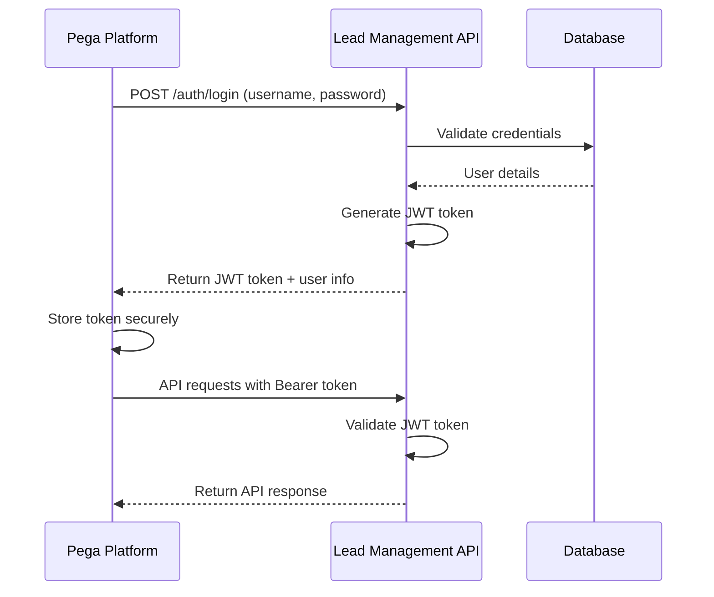

# Security Documentation - Lead Management Service

## Overview

This document outlines the security mechanisms, authentication, authorization, and best practices for the Lead Management Service API integration with Pega platform.

## Table of Contents

1. [Authentication Mechanism](#authentication-mechanism)
2. [JWT Token Structure](#jwt-token-structure)
3. [Authorization Matrix](#authorization-matrix)
4. [Security Best Practices](#security-best-practices)
5. [CORS Policy](#cors-policy)
6. [API Key Management](#api-key-management)
7. [Data Protection](#data-protection)
8. [Audit and Monitoring](#audit-and-monitoring)

## Authentication Mechanism

### JWT (JSON Web Token) Authentication

The Lead Management Service uses JWT tokens for stateless authentication. This approach provides:

- **Stateless**: No server-side session storage required
- **Scalable**: Tokens can be validated independently
- **Secure**: Cryptographically signed tokens prevent tampering
- **Flexible**: Tokens can contain custom claims

### Authentication Flow



### Token Generation Process

1. **User Login**: User provides username and password
2. **Credential Validation**: API validates against database
3. **Token Creation**: Generate JWT with user claims
4. **Token Signing**: Sign token with secret key
5. **Token Return**: Return token to client

### Token Validation Process

1. **Token Extraction**: Extract token from Authorization header
2. **Signature Verification**: Verify token signature
3. **Expiration Check**: Check token expiration time
4. **Claims Validation**: Validate user claims
5. **User Lookup**: Verify user still exists and is active

## JWT Token Structure

### Header

```json
{
  "alg": "HS256",
  "typ": "JWT"
}
```

### Payload (Claims)

```json
{
  "sub": "username",
  "iat": 1640995200,
  "exp": 1641081600,
  "userId": 1,
  "role": "SALES_PERSON",
  "username": "sales1",
  "firstName": "Jane",
  "lastName": "Smith"
}
```

### Claims Description

| Claim | Type | Description | Example |
|-------|------|-------------|---------|
| `sub` | String | Subject (username) | "sales1" |
| `iat` | Number | Issued at (timestamp) | 1640995200 |
| `exp` | Number | Expiration (timestamp) | 1641081600 |
| `userId` | Number | User ID | 1 |
| `role` | String | User role | "SALES_PERSON" |
| `username` | String | Username | "sales1" |
| `firstName` | String | First name | "Jane" |
| `lastName` | String | Last name | "Smith" |

### Token Format

```
eyJhbGciOiJIUzI1NiIsInR5cCI6IkpXVCJ9.eyJzdWIiOiJzYWxlczEiLCJpYXQiOjE2NDA5OTUyMDAsImV4cCI6MTY0MTA4MTYwMCwidXNlcklkIjoxLCJyb2xlIjoiU0FMRVNfUEVSU09OIiwidXNlcm5hbWUiOiJzYWxlczEiLCJmaXJzdE5hbWUiOiJKYW5lIiwibGFzdE5hbWUiOiJTbWl0aCJ9.signature
```

### Token Expiration

- **Default Expiration**: 24 hours (86400000 milliseconds)
- **Refresh Strategy**: Re-authenticate when token expires
- **Clock Skew Tolerance**: 5 minutes
- **Maximum Token Age**: 24 hours

## Authorization Matrix

### Role-Based Access Control (RBAC)

The system implements role-based access control with two primary roles:

#### SALES_PERSON Role

| Endpoint | Method | Access | Description |
|----------|--------|--------|-------------|
| `/auth/login` | POST | ✅ | Login |
| `/auth/register` | POST | ✅ | Register |
| `/leads` | GET | ✅ | View all leads |
| `/leads/{id}` | GET | ✅ | View lead details |
| `/leads` | POST | ✅ | Create lead |
| `/leads/{id}` | PUT | ✅ | Update lead |
| `/leads/my-leads` | GET | ✅ | View assigned leads |
| `/leads/{id}/escalate` | POST | ✅ | Escalate high-value lead |
| `/leads/{id}/request-approval` | POST | ✅ | Request approval |
| `/leads/{id}/status` | PUT | ✅ | Update lead status |
| `/leads/{id}/recalculate-score` | POST | ✅ | Recalculate score |
| `/leads/{leadId}/history` | GET | ✅ | View lead history |
| `/leads/{leadId}/history/comments` | POST | ✅ | Add comments |
| `/leads/distribute` | POST | ❌ | Distribute leads (Manager only) |
| `/leads/{id}/approve` | POST | ❌ | Approve lead (Manager only) |
| `/leads/{id}/reject` | POST | ❌ | Reject lead (Manager only) |

#### SALES_MANAGER Role

| Endpoint | Method | Access | Description |
|----------|--------|--------|-------------|
| All SALES_PERSON endpoints | - | ✅ | Full access to all sales person features |
| `/leads/distribute` | POST | ✅ | Distribute leads to sales team |
| `/leads/{id}/approve` | POST | ✅ | Approve lead conversion |
| `/leads/{id}/reject` | POST | ✅ | Reject lead conversion |
| `/leads/new` | GET | ✅ | View new unassigned leads |
| `/leads/high-value` | GET | ✅ | View high-value leads |
| `/leads/distribution-stats` | GET | ✅ | View distribution statistics |

### Permission Checks

#### Endpoint-Level Security

```java
// Example: Manager-only endpoint
@PreAuthorize("hasRole('SALES_MANAGER')")
@PostMapping("/leads/distribute")
public ResponseEntity<ApiResponse<String>> distributeLeads() {
    // Implementation
}
```

#### Business Logic Security

```java
// Example: Lead escalation authorization
public boolean canEscalateLead(Long leadId, User currentUser) {
    Lead lead = leadService.findById(leadId);
    
    // Check if user is assigned to the lead
    if (lead.getAssignedTo() == null || 
        !lead.getAssignedTo().getId().equals(currentUser.getId())) {
        return false;
    }
    
    // Check if lead is high-value
    return leadScoringService.isHighValueLead(lead);
}
```

## Security Best Practices

### 1. Token Security

#### Token Storage

- **Client-Side**: Store tokens in secure HTTP-only cookies when possible
- **Pega Platform**: Store tokens in encrypted data pages
- **Never**: Store tokens in localStorage or sessionStorage for sensitive applications

#### Token Transmission

- **HTTPS Only**: Always transmit tokens over HTTPS
- **Authorization Header**: Use `Authorization: Bearer <token>` format
- **No URL Parameters**: Never include tokens in URL parameters

#### Token Rotation

```java
// Implement token refresh logic
public String refreshToken(String currentToken) {
    if (isTokenExpiringSoon(currentToken)) {
        // Re-authenticate to get new token
        return authenticateUser(username, password);
    }
    return currentToken;
}
```

### 2. Password Security

#### Password Hashing

- **Algorithm**: BCrypt with salt rounds = 12
- **Salt**: Automatic salt generation per password
- **Verification**: Use BCrypt's built-in verification

```java
// Password hashing
String hashedPassword = BCrypt.hashpw(plainPassword, BCrypt.gensalt(12));

// Password verification
boolean isValid = BCrypt.checkpw(plainPassword, hashedPassword);
```

#### Password Requirements

- **Minimum Length**: 8 characters
- **Complexity**: At least one uppercase, lowercase, number, and special character
- **History**: Prevent reuse of last 5 passwords
- **Expiration**: 90 days (configurable)

### 3. Input Validation

#### Request Validation

```java
// Validate all input data
@Valid @RequestBody LeadRequest leadRequest

// Custom validation annotations
@NotBlank(message = "Lead name is required")
@Size(max = 100, message = "Lead name must not exceed 100 characters")
private String leadName;
```

#### SQL Injection Prevention

- **Parameterized Queries**: Use JPA/Hibernate parameterized queries
- **Input Sanitization**: Sanitize all user inputs
- **Query Validation**: Validate query parameters

### 4. API Security

#### Rate Limiting

- **Per User**: 1000 requests per hour
- **Per IP**: 5000 requests per hour
- **Burst Limit**: 100 requests per minute

#### Request Size Limits

- **Max Request Size**: 10MB
- **Max Field Size**: 1MB
- **Max Array Size**: 1000 items

#### CORS Configuration

```java
// CORS configuration
@Bean
public CorsConfigurationSource corsConfigurationSource() {
    CorsConfiguration configuration = new CorsConfiguration();
    configuration.setAllowedOriginPatterns(List.of("*"));
    configuration.setAllowedMethods(Arrays.asList("GET", "POST", "PUT", "DELETE", "OPTIONS"));
    configuration.setAllowedHeaders(Arrays.asList("*"));
    configuration.setAllowCredentials(true);
    configuration.setExposedHeaders(Arrays.asList("Authorization"));
    
    UrlBasedCorsConfigurationSource source = new UrlBasedCorsConfigurationSource();
    source.registerCorsConfiguration("/**", configuration);
    return source;
}
```

## CORS Policy

### Allowed Origins

- **Development**: `http://localhost:*` (all ports)
- **Production**: `https://pega.mig.com`, `https://*.mig.com`
- **Testing**: `https://test-pega.mig.com`

### Allowed Methods

- **GET**: Retrieve data
- **POST**: Create resources
- **PUT**: Update resources
- **DELETE**: Delete resources
- **OPTIONS**: Preflight requests

### Allowed Headers

- **Authorization**: JWT token
- **Content-Type**: Request content type
- **Accept**: Response content type
- **X-Requested-With**: AJAX requests

### Exposed Headers

- **Authorization**: JWT token (for refresh)
- **X-Rate-Limit-Remaining**: Rate limit information
- **X-Rate-Limit-Reset**: Rate limit reset time

## API Key Management

### Current Implementation

The system currently uses JWT tokens for authentication. API keys are not implemented but can be added for additional security layers.

### Future API Key Implementation

#### API Key Structure

```
ak_live_1234567890abcdef1234567890abcdef
ak_test_1234567890abcdef1234567890abcdef
```

#### API Key Management

- **Key Generation**: Cryptographically secure random generation
- **Key Storage**: Encrypted storage in database
- **Key Rotation**: Automatic rotation every 90 days
- **Key Revocation**: Immediate revocation capability

#### Usage with JWT

```http
Authorization: Bearer <jwt-token>
X-API-Key: ak_live_1234567890abcdef1234567890abcdef
```

## Data Protection

### Data Encryption

#### At Rest

- **Database**: Oracle Transparent Data Encryption (TDE)
- **Files**: AES-256 encryption for sensitive files
- **Backups**: Encrypted backup storage

#### In Transit

- **HTTPS**: TLS 1.3 for all API communications
- **Database**: TLS for database connections
- **Internal**: TLS for internal service communications

### Data Classification

#### Public Data

- **Lead Names**: Company names, contact names
- **Lead Sources**: Lead source information
- **Lead Scores**: Calculated lead scores

#### Internal Data

- **User Information**: Usernames, roles, contact info
- **Lead Details**: Email addresses, phone numbers
- **Lead History**: Activity logs, comments

#### Confidential Data

- **Passwords**: Hashed passwords only
- **API Keys**: Encrypted storage
- **Tokens**: JWT tokens (temporary)

### Data Retention

#### Lead Data

- **Active Leads**: Retained indefinitely
- **Converted Leads**: Retained for 7 years
- **Rejected Leads**: Retained for 2 years

#### User Data

- **Active Users**: Retained while active
- **Inactive Users**: Retained for 1 year after deactivation
- **Audit Logs**: Retained for 7 years

#### API Logs

- **Access Logs**: Retained for 1 year
- **Error Logs**: Retained for 2 years
- **Security Logs**: Retained for 7 years

## Audit and Monitoring

### Security Events

#### Authentication Events

- **Login Success**: User successfully authenticated
- **Login Failure**: Failed authentication attempts
- **Token Refresh**: JWT token refreshed
- **Logout**: User logout events

#### Authorization Events

- **Access Granted**: Successful authorization
- **Access Denied**: Failed authorization attempts
- **Role Changes**: User role modifications
- **Permission Changes**: Permission modifications

#### Data Events

- **Data Access**: Data retrieval events
- **Data Modification**: Data creation, update, deletion
- **Data Export**: Data export events
- **Data Import**: Data import events

### Monitoring and Alerting

#### Real-Time Monitoring

- **Failed Login Attempts**: Alert after 5 failed attempts
- **Suspicious Activity**: Unusual access patterns
- **Rate Limit Exceeded**: API rate limit violations
- **Error Rate**: High error rates

#### Security Metrics

- **Authentication Success Rate**: 95%+ target
- **Authorization Success Rate**: 98%+ target
- **API Response Time**: < 2 seconds target
- **Error Rate**: < 1% target

### Logging

#### Security Logs

```json
{
  "timestamp": "2024-01-15T10:30:00Z",
  "level": "INFO",
  "event": "AUTHENTICATION_SUCCESS",
  "userId": 1,
  "username": "sales1",
  "ipAddress": "192.168.1.100",
  "userAgent": "Mozilla/5.0...",
  "sessionId": "sess_1234567890"
}
```

#### Audit Logs

```json
{
  "timestamp": "2024-01-15T10:30:00Z",
  "level": "INFO",
  "event": "LEAD_CREATED",
  "userId": 1,
  "username": "sales1",
  "leadId": 123,
  "leadName": "John Smith",
  "company": "ABC Corp",
  "ipAddress": "192.168.1.100"
}
```

### Compliance

#### GDPR Compliance

- **Data Minimization**: Collect only necessary data
- **Right to Access**: Provide data access to users
- **Right to Deletion**: Allow data deletion requests
- **Data Portability**: Export user data

#### SOX Compliance

- **Access Controls**: Implement proper access controls
- **Audit Trails**: Maintain comprehensive audit trails
- **Data Integrity**: Ensure data integrity
- **Change Management**: Document all changes

## Security Incident Response

### Incident Classification

#### Level 1 - Low

- **Single failed login**: Monitor and log
- **Rate limit exceeded**: Temporary blocking
- **Minor data exposure**: Immediate containment

#### Level 2 - Medium

- **Multiple failed logins**: Account lockout
- **Suspicious activity**: Investigation required
- **Data breach attempt**: Immediate response

#### Level 3 - High

- **Successful unauthorized access**: Immediate containment
- **Data breach confirmed**: Full incident response
- **System compromise**: Emergency response

### Response Procedures

1. **Detection**: Automated monitoring and alerting
2. **Assessment**: Evaluate severity and impact
3. **Containment**: Isolate affected systems
4. **Investigation**: Determine root cause
5. **Recovery**: Restore normal operations
6. **Documentation**: Document incident and response
7. **Prevention**: Implement preventive measures

## Security Testing

### Penetration Testing

- **Quarterly**: External penetration testing
- **Annually**: Comprehensive security assessment
- **Ad-hoc**: After major changes

### Vulnerability Scanning

- **Weekly**: Automated vulnerability scans
- **Monthly**: Manual security reviews
- **Continuous**: Real-time monitoring

### Security Code Review

- **All Changes**: Security review for all code changes
- **Critical Paths**: Enhanced review for security-critical code
- **Third-Party**: Review of third-party dependencies

## Contact Information

For security-related questions or to report security issues:

- **Security Team**: security@mig.com
- **Emergency Contact**: +1-555-SECURITY
- **Bug Bounty**: security-bounty@mig.com
- **General Support**: support@mig.com

## Document Version

- **Version**: 1.0
- **Last Updated**: January 15, 2024
- **Next Review**: April 15, 2024
- **Approved By**: Security Team

